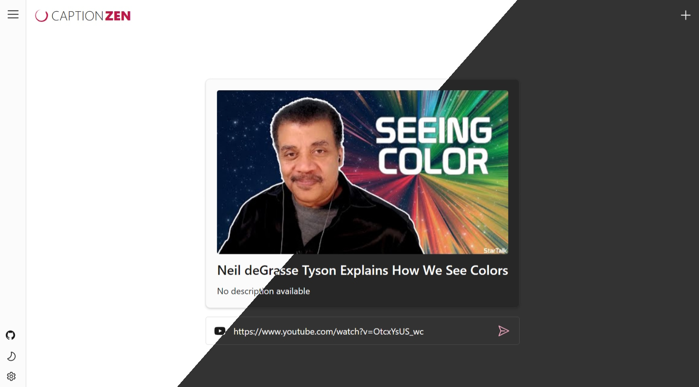

# CaptionZen


## Introduction 
CaptionZen enables users to generate summaries of YouTube videos using AI services. Built with .NET MAUI Blazor Hybrid and Microsoft.Extensions.AI, it demonstrates how to create a cross-platform application that integrates multiple AI providers while maintaining a consistent user experience across web, desktop and mobile platforms.

## Build and Run the sample from source
To run **CaptionZen** in your browser, follow the below steps.

### Prerequisites
- [Git](https://git-scm.com/)
- [.NET 9.0 SDK](https://dotnet.microsoft.com/en-us/download/dotnet/9.0)

### Clone the repository
```Console
git clone https://github.com/binnykanjur/caption-zen.git
```

### Navigate to the Project Folder
```Console
cd caption-zen/src/CaptionZen.Web
```
   
### Set Encryption Keys
```Console
dotnet user-secrets set "Encryption:Key" "a8F3kL9mQ2rT5vX1"
dotnet user-secrets set "Encryption:IV" "Z7pR4sW8nJ6uY3b2"
```

**Run the Application**
```Console
dotnet run
```

> For detailed instructions and more information, read the full article [here](https://binnykanjur.com/captionzen-youtube-video-summarizer).